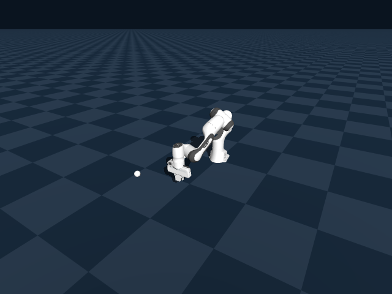
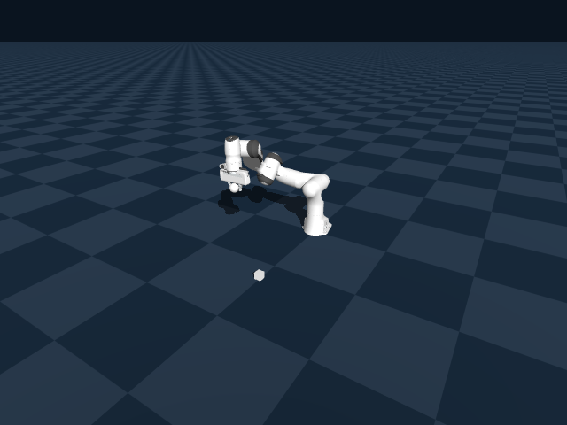

# 🤖 Robotics Dataset Generation & Imitation Learning (Franka Panda)

This project implements a **full robotics + AI pipeline** using simulation to generate data and train intelligent behavior.

It combines:
- 🤖 Robotics simulation (Franka Panda)
- 👁️ Computer Vision (visual perception)
- 🧠 Machine Learning (Imitation Learning / Behavior Cloning)

---

## 📸 Simulation Examples

### 🧊 Cube Task (Pick & Place)


### ⚾ Ball Task (Grasp & Throw)


---

## 🚀 Project Overview

The system is divided into **two main stages**:

### 1️⃣ Episode Generation (Data Collection)

The robot interacts with objects inside a simulated environment and records **episodes**.

Each episode includes:
- RGB images (camera observations)
- Robot states (joint positions, end-effector pose)
- Object states (cube / ball position)
- Actions taken by the robot
- Task phase (approach, grasp, place, throw)

📦 This produces a structured dataset used for training AI models.

---

### 2️⃣ Learning from Demonstrations (AI)

After generating episodes:

- A **Behavior Cloning (BC)** model is trained using PyTorch
- The model learns:
  
👉 *“Given what I see, what action should I take?”*

This enables:
- Learning from expert demonstrations
- Generalization of robot behavior
- Autonomous execution of tasks

---

## 👁️ Computer Vision Component

The system uses visual input to guide decisions:

- RGB camera frames are captured at each timestep
- Optional object detection using **YOLO (Ultralytics)**
- Visual features are used as input to the learning model

👉 This connects **Perception → Action**, which is a core concept in robotics AI.

---

## 🧊 Tasks Implemented

### Cube Task
- Pick-and-place operation
- Safe grasping and placement

### Ball Task
- Grasp and throw behavior
- Includes dynamic motion and release timing

---

## 📁 Project Files

- `cube.py` → Cube dataset generation + training
- `ball.py` → Ball dataset generation
- `cubeBall.py` → Combined multi-task pipeline

---

## 🧠 Advanced Features

- Episode-based dataset generation
- Imitation Learning (Behavior Cloning)
- PyTorch training pipeline
- Model checkpointing and logging
- Metrics & evaluation:
  - Training logs (CSV)
  - Accuracy proxy (MSE-based)
  - Spectral norm tracking
  - Robustness analysis (pruning AUC)

---

## ⚙️ Setup & Installation (Linux)

> ⚠️ Linux (Ubuntu 20.04/22.04 recommended)

### 1️⃣ Update system
```bash
sudo apt update && sudo apt upgrade -y
```

### 2️⃣ Install Python
```bash
sudo apt install python3 python3-pip python3-venv -y
```

### 3️⃣ Create virtual environment
```bash
python3 -m venv venv
source venv/bin/activate
```

### 4️⃣ Install dependencies
```bash
pip install --upgrade pip
pip install numpy opencv-python
```

#### AI (required for training)
```bash
pip install torch
```

#### Computer Vision (optional)
```bash
pip install ultralytics
```

---

## 🤖 Install Genesis Simulator

```bash
pip install genesis-world
```

If needed:
```bash
git clone https://github.com/Genesis-Embodied-AI/Genesis.git
cd Genesis
pip install -e .
```

---

## 🦾 Install Franka Panda Robot Model

⚠️ REQUIRED

```bash
git clone https://github.com/frankaemika/franka_description.git
```

Then:
- Place in simulator assets folder  
OR  
- Update paths in scripts  

---

## ▶️ Running the Project

### 🧊 Cube Task
```bash
python cube.py
```

### ⚾ Ball Task
```bash
python ball.py
```

### 🔄 Full Pipeline
```bash
python cubeBall.py
```

---

## 📦 Output (Dataset)

```
dataset/
├── images/
├── episodes/
```

Each episode contains:
- Observations (images)
- Actions
- Robot state
- Object state
- Task phase

---

## 📊 Training Outputs

```
logs/
├── model.pt
├── training_log.csv
├── metrics_summary.json
```

---

## ⚠️ Common Issues

- Genesis not installed → reinstall / check env  
- Robot not loading → fix Franka model path  
- No output → check dataset directory  

---

## 🔥 Why This Project Is Strong

This project demonstrates:

- Robotics + AI integration  
- Learning from data (not hardcoded)  
- Full pipeline:

👉 **Perception → Dataset → Learning → Control**

---

## 👤 Author

Hussain Alibrahim

---

## 💡 Notes

- Dataset generation works without AI  
- Training requires PyTorch  
- GPU recommended  
- Built for learning and research purposes  
